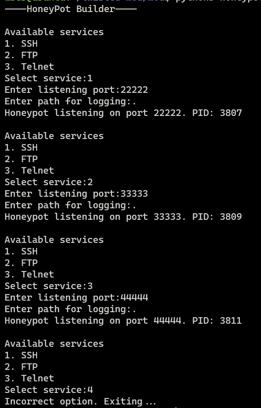
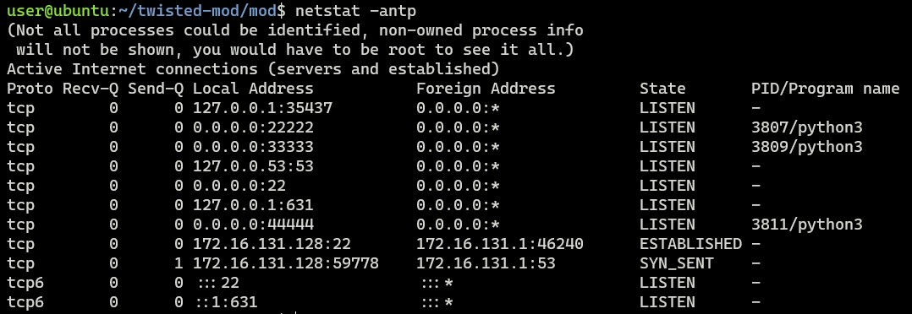
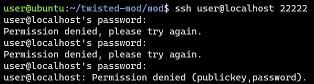
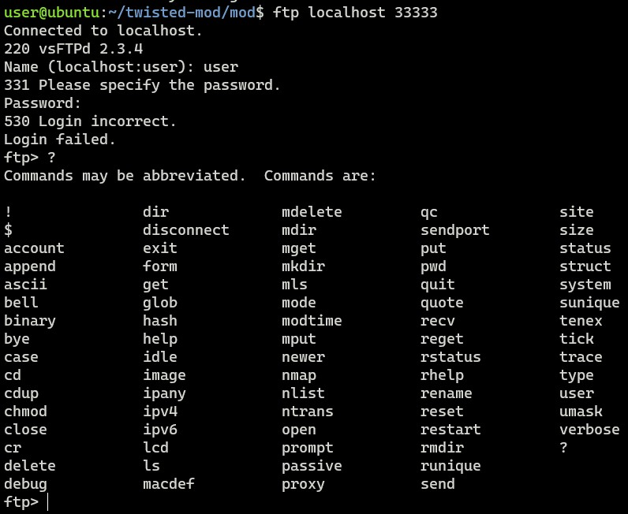
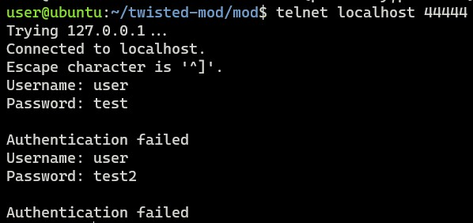
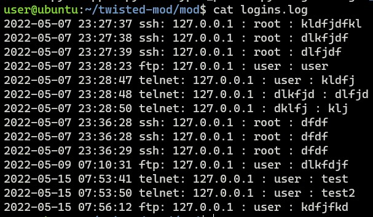

# Configurable Honeypot
* This python tool spawns a honeypot for a given service listening to a user specified port and logs details for every attempted login.
* Supported services:
	* Telnet
	* FTP
	* SSH
* The tool imports scripts from the honeypot project https://github.com/lanjelot/twisted-honeypots, which leverages and overrides classes from twisted python library.
* These honeypots only logs attempted logins and has no post-login activity.
* Current implementation of the tool spawns every honeypot as a child processes, and it has to be explicitly killed by the user.

## Screenshots
* Setting up Honeypots

* Netstat output showing running honeypots
 

* Interaction with honeypots

* Logs

